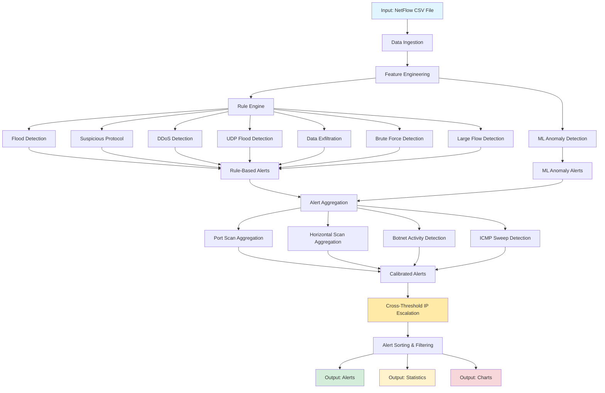

# Threat Detection System - Dataflow Diagram

## Data Flow Stages

### 1. Input & Ingestion
- **Input**: NetFlow CSV file with columns: src_ip, dst_ip, src_port, dst_port, protocol, packets, bytes, flows, start_time, end_time
- **Ingestion**: Polars DataFrame creation with schema validation

### 2. Feature Engineering
Calculates derived fields for detection:
- `bytes_per_packet`: bytes / packets
- `flow_duration`: end_time - start_time
- `packets_per_sec`: packets / flow_duration
- `udp_ratio`: ratio of UDP traffic
- Adaptive percentiles (95th): pkt_p95, byt_p95, bpp_p95, pps_p95

### 3. Rule Engine
Applies detection rules with adaptive thresholds:
- **Flood**: packets > 500
- **Suspicious Protocol**: GRE, ESP, OSPF
- **DDoS**: high packets_per_sec + high packet count
- **UDP Flood**: pure UDP + high packets_per_sec + packets > 100
- **Data Exfiltration**: high bytes + high bytes_per_packet
- **Brute Force**: common ports (22, 23, 3389, 445, 5900, 8080)
- **Large Flow**: high bytes + short duration

### 4. ML Anomaly Detection
- **Model**: PyOD IsolationForest
- **Contamination**: 0.05 (5% expected anomalies)
- **Features**: packets, bytes, bytes_per_packet, packets_per_sec, flow_duration

### 5. Alert Aggregation
Detects patterns across flows:
- **Port Scan**: src_ip hitting 5+ unique ports with small avg packets
- **Horizontal Scan**: src_ip hitting max(15, 5% of dataset) unique destinations
- **Botnet Activity**: src_ip with 50+ flows to 30+ unique destinations
- **ICMP Sweep**: src_ip sending ICMP to 2+ unique destinations

### 6. Arbitration & Calibration
Combines signals and assigns severity:
- **Scan Types**: Port/horizontal scans → CONFIRMED (auto-escalate)
- **Single Flow + No ML**: MONITOR (40-60% confidence)
- **Rule + ML**: CONFIRMED (75-99% confidence)
- **Temporal Correlation**: Escalates based on clustering
- **Multi-Signal**: CONFIRMED (2+ rule signals)

### 7. Cross-Threshold IP Escalation
- Tracks threat types per source IP
- If IP has 2+ distinct threat types → escalate all alerts to highest severity
- Adds +0.10 confidence boost to escalated alerts

### 8. Output
- **Alerts**: Sorted by severity (CONFIRMED > HIGH > SUSPICIOUS > MONITOR) and confidence
- **Statistics**: Threat counts, protocol distribution, top attackers
- **Charts**: Confidence histogram, threat timeline, protocol pie chart

## Severity Levels

| Severity | Description | Confidence Range |
|----------|-------------|------------------|
| CONFIRMED | Multi-signal or scan-type threats | 75-99% |
| HIGH | Single strong signal | 55-75% |
| SUSPICIOUS | Moderate correlation | 55-75% |
| MONITOR | Weak or uncorrelated signals | 40-60% |

## Key Design Decisions

1. **Adaptive Thresholds**: Percentiles scale with dataset characteristics
2. **Scan Exception**: Port/horizontal scans auto-escalate regardless of other signals
3. **IP-Level Detection**: Accuracy evaluated at IP level, not flow level
4. **Cross-Threat Escalation**: Multi-pattern actors get highest severity across all alerts
5. **ML Contamination**: 5% to balance precision/recall trade-off
